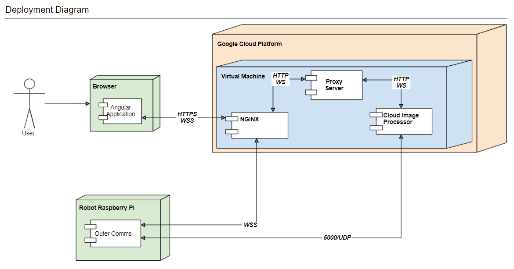

# Land-drone

A high-level diagram can be found in the image below:

The Angular application can be found in the folder `test-image-viewer`. 

The nginx configuration can be found in the folder `cloud-server/nginx-config` 

The proxy server is in the `cloud-server` directory. 

The cloud image processor is in the folder `cloud2`.

The outer comms is in the folder `drone-node`.

Although not shown in this image, the `drone-python` folder contains
the program for controlling the drone engine.

Altough not shown in this image, the folder `udp-packer` contains an 
npm module for packing and unpacking images.
